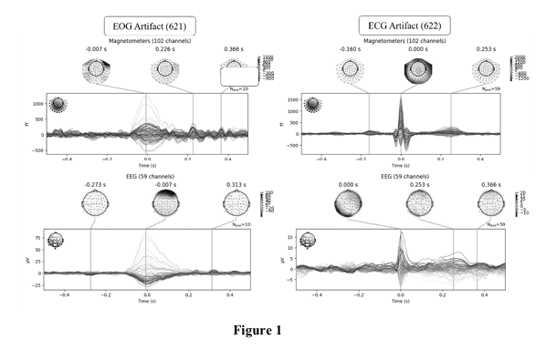

# 🧠 Cost-Effective Brain-Wave Sensor System

> A patented low-cost brain-sensor system that uses real-time EEG signals and deep learning to control robotic arms via brain commands.

A low-cost, accurate Brain-Computer Interface (BCI) system designed to collect and classify real-time Motor Imagery EEG signals and control robotic systems like a 4-axis robotic arm using deep learning and IoT.

---

## 📜 Patent Information

- **Title**: A Cost-Effective Brain-Wave Sensor System for Collecting Real-Time Motor Imagery Electroencephalogram (EEG) Data
- **Filed By**: Symbiosis International (Deemed University)
- **Inventors**: Vedant Mate, Nandakumar
- **Filed On**: June 5, 2024
- **Published**: August 2024
- **Technology Domains**: Brain-Computer Interface (BCI), Robotics, Embedded Systems, IoT, Signal Processing, Deep Learning

---

## 🧩 Key Features

- 🧠 12-node EEG capture system using low-cost BioAmp EXG Pill
- 🧹 Deep Learning models for real-time artifact removal and classification
- ⚡ Real-time robotic arm control using virtual joystick
- 🌐 Edge computing + IoT integration via MQTT protocol
- 💸 Extremely cost-efficient using open-source components and Arduino

---

## 🔧 Hardware Architecture

- BioAmp EXG Pills (x4)
- Dry/Wet Electrodes (12 nodes)
- Arduino UNO R3
- HC-05 Bluetooth Module
- EMI Shielding with Aluminum Enclosure

---

## 🧠 Software Architecture

### Signal Processing Unit (SPU):
- High-pass, Low-pass, Median, Notch filters
- Bandpass + Wavelet denoising

### Deep Learning:
- **Model 1**: Artifact Removal (EOG, ECG, EMG)
- **Model 2**: Motor Imagery Classification

### Communication:
- BLE from sensor to base station (PC)
- GPU/Cloud for inference
- MQTT protocol to send actuator control signals

---

## ⚙️ System Workflow

1. EEG signal captured via electrodes  
2. Noise filtered → DL Model 1 → Clean EEG  
3. Classified by DL Model 2 → Command generated  
4. Robotic arm moved via actuator signal  

---

## 🤖 Applications

- Assistive technology for the physically challenged
- Robotic arm, drone, or vehicle control via brain signals
- Hands-free interface in AR/VR and industrial robots

---

## 🧠 Brainwave Frequency Chart

| Wave Type | Frequency (Hz) | Mental State                        |
|-----------|----------------|-------------------------------------|
| Alpha (α) | 8–12           | Relaxed, passive attention          |
| Beta (β)  | 12–35          | Active, external attention          |
| Gamma (γ) | >35            | Deep concentration                  |
| Delta (δ) | 0.5–4          | Deep sleep                          |
| Theta (θ) | 4–8            | Inward focus, deep relaxation       |

---

## 🖼️ Patent Figures

> 📁 All images are located in the `/images` folder

### 🧪 Figure 1: EEG Signal with Artifacts  

### 🧪 Figure 2: Prototype and System Flow  

### 🧪 Figure 3: 12-Node Electrode Arrangement  

### 🧪 Figure 4: Hardware System Schematic  

### 🧪 Figure 5: Arduino + BioAmp Circuit Diagram  

### 🧪 Figure 6: Software Architecture  

---

## 🔮 Future Scope

- Upgrade DL models with transformer-based EEG classification
- Live dashboards with EEG metrics on cloud
- BCI-based control of drones and wheelchairs

---

## 🛡 License

This repository is for academic and research use only. Contact the inventors for commercial usage.

---

## 🙌 Authors & Credits

Filed by **Symbiosis International (Deemed University)**  
Invented by: **Vedant Mate** and **Nandakumar**  
Open hardware and software tools chosen to promote low-cost BCI development

---
